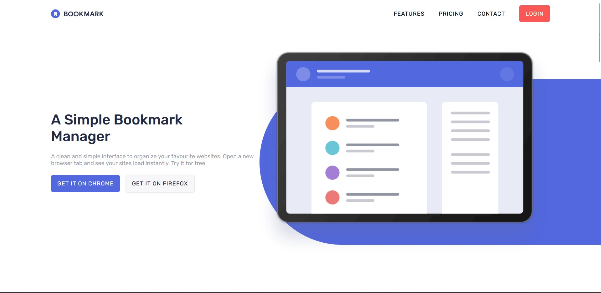

# Frontend Mentor - Bookmark landing page solution

This is a solution to the [Bookmark landing page challenge on Frontend Mentor](https://www.frontendmentor.io/challenges/bookmark-landing-page-5d0b588a9edda32581d29158). Frontend Mentor challenges help you improve your coding skills by building realistic projects. 

## Table of contents

- [Frontend Mentor - Bookmark landing page solution](#frontend-mentor---bookmark-landing-page-solution)
  - [Table of contents](#table-of-contents)
  - [Overview](#overview)
    - [Screenshot](#screenshot)
    - [Links](#links)
  - [My process](#my-process)
    - [Built with](#built-with)
  - [Author](#author)

## Overview

### Screenshot

### Links

- Solution URL: [Solution URL](https://github.com/quenyoni/bookmark-landing-page)
- Live Site URL: [Live Site](https://bookmark-landing-page-sepia.vercel.app/)

## My process

### Built with

- HTML
- Javascript
- SCSS
- Animate on Scroll(AOS)

## Author

- X - [@quenyoni](https://www.twitter.com/quenyoni)
